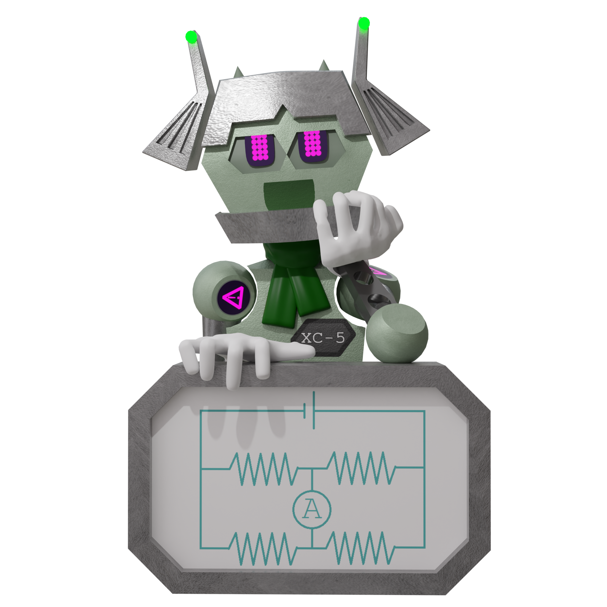

# XC5 Wheatstone

Wheatstone is my beloved VTuber model. He is modelled in Blender 4.0 (starting from 3.6) and exported using the [VRM Addon for Blender](https://vrm-addon-for-blender.info/en/).

I use a modified version of Virtual Puppet Project (vpuppr) version 0.9.0. The only modification needed is the `vrm_model.gd` file where the code for eye rotations is changed to changing blend shapes. Feel free to use this for your own project.

The art files in this repository come under a Creative Commons Attribution-NonCommercial-ShareAlike 3.0 license. Please give me credit if you are going to do anything with them. You can mention my personal website boraini.com.